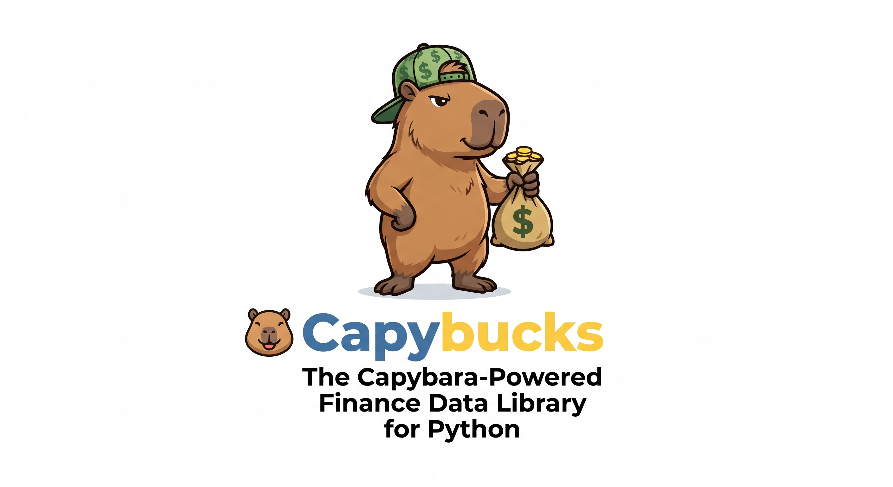

<p align="center">
  
</p>

<h1 align="center">capybucks</h1>
<p align="center">The capybara-powered finance data library for Python.</p>

Market data as a one-liner: `download()` / `Ticker`, pandas DataFrames,
typed errors, pluggable providers, and a path to paid real-time APIs
without changing your import.

## Status

Phase 2 — history, financials, options, news, and actions on `Ticker`.
Yahoo is the zero-config equity default; CoinGecko covers crypto; Twelve
Data is the first paid provider on the same API. Stooq is pin-only
(`provider="stooq"`) because it often serves a JS bot-check.

## Why

The options most people reach for online share the same failure modes:
they pin a single unofficial HTTP endpoint, retry a delisted ticker until
the notebook hangs, return an empty frame or silent `NaN` instead of an
error, and leave you with nowhere to go when you need a licensed or
real-time feed.

capybucks keeps the one-liner and makes the failure honest — one provider
per series, provenance on `df.attrs`, typed errors, and a paid source on
the same import.

```python
import capybucks as cb

df = cb.download("AAPL", period="1y")
print(df.attrs["provider"], df.attrs.get("delayed"))

aapl = cb.Ticker("AAPL")
income = aapl.financials
chain = aapl.option_chain()
print(aapl.dividends, aapl.news.head())
```

Paid data, same import:

```python
# env CAPYBUCKS_TWELVEDATA_KEY, or ~/.capybucks.toml [keys]
df = cb.download("AAPL", provider="twelvedata")
```

```toml
# ~/.capybucks.toml
[keys]
twelvedata = "your-key"
```

## Install

```bash
pip install capybucks
```

or `uv add capybucks`. Python 3.11 or newer.

Optional extras:

```bash
pip install "capybucks[calendars,stream]"   # [ta] [calendars] [stream] [polars]
```

Indicators live in `capybucks.ta` (pandas, already a core dependency).
Session calendars (`BVMF` for `.SA`) need `capybucks[calendars]`.
Twelve Data WebSocket quotes need `capybucks[stream]`.

## API

```python
import capybucks as cb

cb.download("AAPL", period="1y")
cb.Ticker("AAPL").history()
cb.Ticker("AAPL").financials
cb.Ticker("AAPL").option_chain()
```

OHLCV columns: `Open`, `High`, `Low`, `Close`, `Adj Close`, `Volume`.
Daily equities default to Yahoo. Crypto tickers such as `BTC-USD` go to
CoinGecko. Pin a source with `provider="yahoo"` / `"twelvedata"` /
`"stooq"`. Missing symbols raise `SymbolNotFound` (not an empty frame);
rate limits and missing keys have their own types.

B3 tickers need the Yahoo suffix (`PETR4.SA`); bare `PETR4` raises
`SymbolNotFound` with that hint.

```python
from capybucks.ta import rsi, enrich

frame = enrich(cb.download("AAPL", period="6mo"))
print(rsi(frame["Close"]).tail())
```

## Disclaimer

The **software** is MIT-licensed. The **data** is not. Yahoo Finance
endpoints used by similar libraries are unofficial, usually delayed (~15
minutes), and Yahoo's terms restrict automated collection. Do not
redistribute provider data. `df.attrs["delayed"]` is part of the contract
so a delayed quote cannot masquerade as real-time.

## Docs

[**HTML (English / Português)**](https://witmondcal-maker.github.io/capybucks/)
— hosted user guide and API. Portuguese is at
[`/pt/`](https://witmondcal-maker.github.io/capybucks/pt/).

- [**Notebook**](./examples/getting_started.ipynb) — same path, runnable in Jupyter (needs network)

For contributors:

- [`docs/README.md`](./docs/README.md) — build the Sphinx site; keep EN and PT in sync
- [`ROADMAP.md`](./ROADMAP.md) — phases toward an honest one-liner and a paid path
- [`docs/architecture.md`](./docs/architecture.md) — layers and data flow
- [`docs/adr/`](./docs/adr/) — architecture decision records
- [`CONTRIBUTING.md`](./CONTRIBUTING.md) — review rules
- [`AGENTS.md`](./AGENTS.md) — instructions for coding agents
